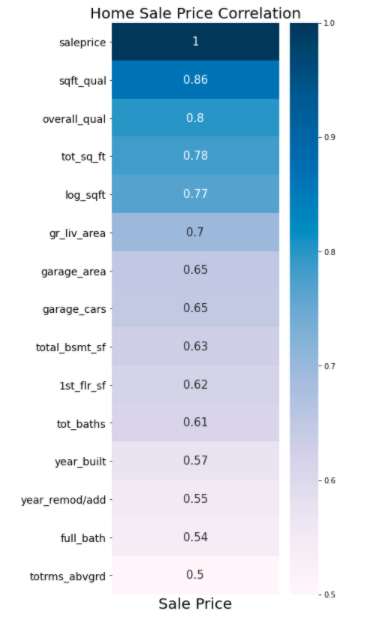

# Ames Housing Data and Kaggle Challenge

### Contents:
- [Executive Summary](#Executive-Summary)
- [Problem Statement](#Problem-Statement)
- [Conclusions and Recommendations](#Conclusions-and-Recommendations)
- [Data Dictionary](#Data-Dictionary)

### Executive Summary

For this project, we are exploring the Ames, Iowa Housing Data, which are home sale values from 2008 to 2010. We will use linear regression models to discover relevant home features that influence home sale prices and then predict sale prices for future home sales.

### Problem Statement 

A house is usually a family's biggest asset. Selling a home is a huge decision. Pricing a home too low could result in a lost financial opportunity, while setting a price too high, could result in a longer sale time and ultimately a lower price than setting the price lower to begin with. This 2019 article on thebalance.com https://www.thebalance.com/the-worst-home-selling-mistake-1798971 explains why setting a price too low or too high can turn into a sizeable mistake for the seller. 

With this in mind, we need to make sure that we are setting values for new homes at an appropriate price to ensure an efficient sale at a fair price for the seller. 

### Conclusions and Recommendations

In modeling the data, and looking at how different variables effect the predicted price versus actual price, we find several key factors that should be prioritized when setting the value of a home. 

- Total Number of Bathrooms in the house
- Total Number of rooms above ground (i.e. excluding the basement)
- Total Square Footage
- Condition of the square footage
- Total Square Footage of the basement

### About the Data

The python notebooks begin with importing the training dataset csv, cleaning, sorting, and imputing through the 81 columns and 2051 rows. Once cleaned, we explore the data through correlation calculations and visuals to determine 

I have sorted the data into this top directory and 3 sub directories. 
|__ README.md
   |__ you are here
|__ Ames_Housing_Data_Presentation.pdf
|__ Ames_Model_Worksheet.ipnyb
   |__ python workbook for modeling data
|__ Ames_Train_Eda.ipynb
   |__ python workbook for EDA of datasets
|__ /datasets
   |__ csv files
|__ /images
   |__ support images for presentation 

These notebooks begin by downloading the Ames data sets from Kaggle.com.  We then parse through the data, cleaning the NaN values, imputing values and then feature engineering new columns using get_dummies and interaction columns. Then we move to the modeling sheet to try various features and how they influence the Root Mean Squared Error Score using LinearRegression, Lasso and Ridge models. 

We then output a csv file to be uploaded and submitted to Kaggle's competition webpage. 

### Data Dictionary

|Feature|Type|Dataset|Description|
|---|---|---|---|
|id               |    int64 | train.csv | The unique id of the home. | 
|lot_frontage     |  float64 | train.csv | The width of the property facing the street measured in ft. | 
|lot_area         |    int64 | train.csv | The square footate of the total property. | 
|street           |   object | train.csv | The street name of the house address. | 
|land_contour     |   object | train.csv | A description of the slope of the property | 
|lot_config       |   object | train.csv | A description of the configuration of the property | 
|neighborhood     |   object | train.csv | The neighborhood of the home in Ames, Iowa | 
|house_style      |   object | train.csv | Categorical styles of the house | 
|overall_qual     |    int64 | train.csv | Overall Quality of the house on a scale of 1-10 | 
overall_cond      |   int64 | train.csv | Overall Condition of the house on a scale of 1-10 | 
year_built        |   int64 | train.csv | Year the House was originally built. | 
year_remod/add    |   int64 | train.csv | Year the house was most recently remodeled. | 
exter_qual        |  object | train.csv | Quality of the exterior. | 
exter_cond        |  object | train.csv | The condition of the exterior of the house. | 
bsmt_qual         |  object | train.csv | The overall quality of the basement as categories. | 
bsmt_cond         |  object | train.csv | The overall condition of the basement as categories. | 
total_bsmt_sf     | float64 | train.csv | Total finished and unfinished basement square footage | 
1st_flr_sf        |   int64 | train.csv | Total square footage of the first floor. | 
2nd_flr_sf        |   int64 | train.csv | Total square footage of the second floor. | 
gr_liv_area       |   int64 | train.csv | Total square footage of the living area in the house. | 
bsmt_full_bath    | float64 | train.csv | Number of full bathrooms in the basement. | 
bsmt_half_bath    | float64 | train.csv | Number of half bathrooms in the basement. | 
full_bath         |   int64 | train.csv | Number full bathrooms in the 1st and 2nd floors. | 
half_bath         |   int64 | train.csv | Number half bathrooms in the 1st and 2nd floors. | 
bedroom_abvgr     |   int64 | train.csv | Number of bedrooms above ground in the house. | 
kitchen_qual      |  object | train.csv | The categorical types of kitchen quality. | 
totrms_abvgrd     |   int64 | train.csv | The total number of rooms above ground ih the house.  | 
fireplaces        |   int64 | train.csv | The number of fireplaces. | 
garage_cars       | float64 | train.csv | The number of cars that will fit in the garage.  | 
garage_area       | float64 | train.csv | The total square footage of the garage | 
garage_cond       |  object | train.csv | Garage condition | 
wood_deck_sf      |   int64 | train.csv | Square footage of the outdoor deck. | 
pool_area         |   int64 | train.csv | Square footage of pool area, if a pool exist.  | 
mo_sold           |   int64 | train.csv | Month of the year sold, as an integer | 
yr_sold           |   int64 | train.csv | Year the house was sold. | 
saleprice         |   int64 | train.csv | Price for which the house was sold. | 
shape_ir2         |   int64 | train.csv | Whether or not the house has an irregular lot shape style 2 | 
shape_ir3         |   int64 | train.csv | Whether or not the house has an irregular lot shape style 3 | 
shape_reg         |   int64 | train.csv | Whether or not the house has an reguarl lot shape | 
tot_baths         | float64 | train.csv | Total number of bathrooms in the house | 
tot_sq_ft         | float64 | train.csv | Sum of square footages of house, basement, lot, and garage. | 
sqft_qual         | float64 | train.csv | Taking the quality score and multiplying by total square footage | 
sale_new          |   uint8 | train.csv | Whether or not the Sale Type of the house was New, meaning no previous owner | 
sale_wd_          |   uint8 | train.csv | Whether or not the Sale Type of the house was a normal sale between someone who owns the deed and a normal buyer. | 
edwards           |   int64 | train.csv | Whether or not the house is in the edwards neighborhood | 

